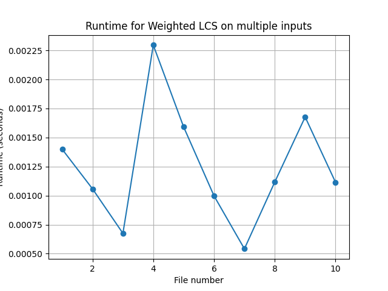

Programming Assignment 3: Highest Value Longest Common Sequence

Om Vaddi (15302285)
Thomas Alvarado (65211333)

Instructions:
- After cloning, run "cd COP4533-Highest-Value-Longest-Common-Sequence"
- Create an input file in the files folder.
- See assumptions section for file formatting.
- Run "python src/sequence.py".
- Enter the file path when prompted. ex: files/file1.txt
- Read output.

Example input (files/example.in):  
3  
a 4  
b 2  
c 3  
abcb  
bcab

Example output (files/example.out):  
7  
bcb

Assumptions:
- The first line of the file should be an integer K >= 1, where K represents how many letters are in the alphabet. The next K lines should each contain a character and its  value seperated by a space. The next line should contain string A. The next and final line should contain string B. Both string A and B should only contain characters found in the alphabet.
- The output will display the value of the highest value common subsequence of string A and B on the first line. The second line will display the highest value common subsequence.

Question 1: Empirical Comparison 
